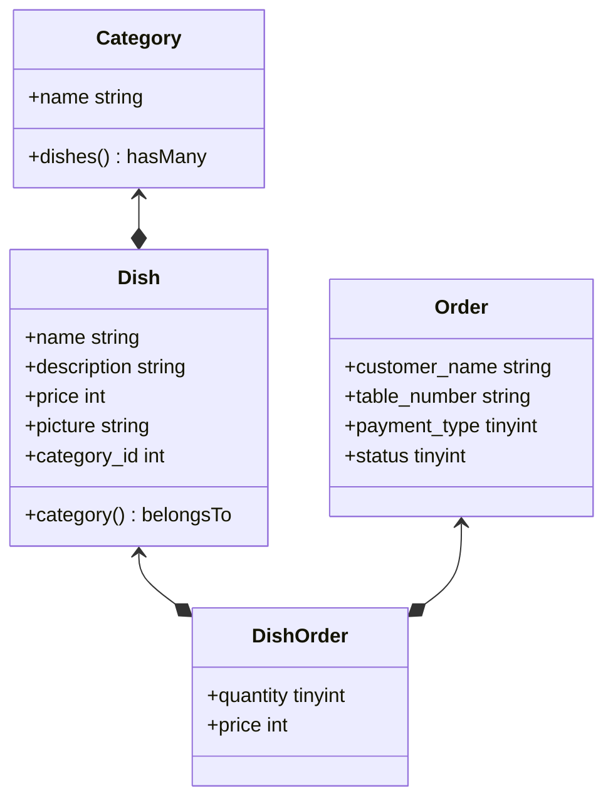

## ERD

```mermaid
classDiagram
	Category <--* Dish
	Dish <--* DishOrder
	Order <--* DishOrder
	
	class Category {
		+name string
		+dishes() hasMany
	}
	
	class Dish {
		+name string
		+description string
		+price int
		+picture string
		+category_id int
		+category() belongsTo
	}
	
	class Order {
		+customer_name string
		+table_number string
		+payment_type tinyint
		+status tinyint
	}
	
	class DishOrder {
		+quantity tinyint
		+price int
	}
```

